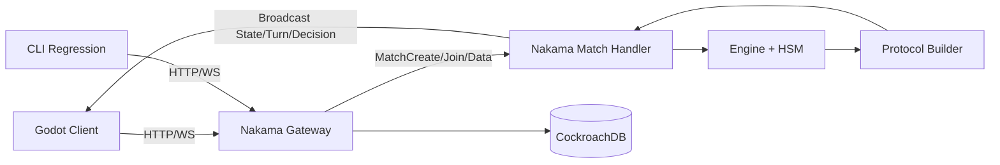

# ParaDiced 技术规划书（仿课程样式）

> 项目形态：前端 Godot，后端 Nakama + Go（权威服务器）

## Part 1 技术选型与运行环境

### 1.1 程序设计语言

- 前端：GDScript（Godot 4）
- 后端：Go 1.22.4（Nakama Go Runtime 插件）

### 1.2 应用开发框架

- 前端：Godot 客户端（UI、输入、动画播放、网络收发）
- 后端：Nakama 3.22.0 + Go Match Handler + HSM（分层状态机）
- 协议层：`pkg/net` + `internal/net`（OpCode、消息体、同步结构）

### 1.3 运行环境

- 服务器运行时：Docker / Docker Compose
- 服务组件：`heroiclabs/nakama:3.22.0` + `cockroachdb/cockroach:latest-v23.1`
- 本地开发环境：Linux/macOS

### 1.4 技术选型理由

1. Nakama 适配实时多人对局，房间与会话能力成熟。
2. Go 适合实现高并发、可测试的权威逻辑。
3. HSM 能稳定表达“回合主流程 + 中断决策 + 恢复”复杂路径。
4. Godot 便于快速搭建回合制 UI 与动画表现层。
5. Docker 便于课程阶段统一部署与复现实验结果。

## Part 2 软件总体架构

### 2.1 子系统划分

本项目主要包含 4 个子系统：

1. 前端子系统（Godot）
2. 后端对局子系统（Nakama + Go）
3. 协议与同步子系统（StateSync / TurnSync / Decision）
4. 部署与回归子系统（Docker + CLI Playtest）

### 2.2 总体架构图



### 2.3 子系统职责

#### 2.3.1 前端（Godot）

- 功能：发起登录、创建/加入对局、提交玩家意图、渲染权威状态。
- 模块：网络层、界面层、动画层、重连恢复层。
- 约束：不做最终状态裁决，只做表现与本地预测。

#### 2.3.2 后端（Nakama + Go）

- 功能：处理 Match 生命周期、执行规则、广播权威结果。
- 模块：`internal/nakama`、`internal/engine`、`internal/core`。
- 约束：所有状态变更必须由服务端落地。

#### 2.3.3 协议与同步

- 功能：统一 OpCode、消息结构、全量与增量同步。
- 模块：`pkg/net`、`internal/net`、`pkg/gamelog`。
- 关键消息：`StateSync`、`TurnSync`、`DecisionRequest`、`DecisionResult`、`GameOver`。

#### 2.3.4 部署与回归

- 功能：统一构建、启动、日志采集、自动化回归。
- 模块：`docker-compose.yml`、`Makefile`、`internal/cli`。

### 2.4 子系统关系与工作模式

1. Godot 前端只发送 `intent`（意图），后端返回 `authoritative state`（权威状态）。
2. 对局主链路由 HSM 控制，任何中断均通过 Decision 机制恢复。
3. 客户端断线重连后，以 FullSync/StateSync 为准重新对齐。

## Part 3 系统开发目标

### 3.1 后端总目标（课程阶段）

本项目后端的核心用途是：**为 Godot 客户端提供一个可裁决、可同步、可恢复的权威对局服务**。

1. **用于对局裁决**：所有规则判定在服务端执行，避免客户端篡改。
2. **用于流程编排**：统一推进从开局到结束的完整回合流程。
3. **用于实时同步**：把当前状态和回合事件持续推送给所有在线玩家。
4. **用于断线恢复**：玩家掉线后可回到同一局并拿到完整权威状态。
5. **用于质量保障**：通过自动化回归验证玩法稳定性和正确性。

### 3.2 后端用于做什么（按业务能力划分）

#### 3.2.1 用于管理一局游戏的生命周期

1. 管理房间从创建、开局、运行到结束的全过程。
2. 维护玩家加入/离开/重连状态，确保同一局内身份一致。
3. 维护当前轮次、当前行动玩家、全局阶段等权威上下文。

#### 3.2.2 用于执行回合制核心玩法

1. 执行主流程：小游戏排名 -> 回合准备 -> 行动 -> 移动 -> 落地 -> 事件 -> 回合结束。
2. 执行关键规则：HP/LP 变化、Buff 持续与移除、道具结算、事件效果。
3. 执行阵营机制：青龙/朱雀/白虎/玄武的被动与触发逻辑。

#### 3.2.3 用于处理中断型交互（需要玩家选择）

1. 在需要选择时向指定玩家发起 `DecisionRequest`。
2. 在收到 `UserChoice` 后恢复流程并继续结算。
3. 超时后自动走默认选项，防止整局卡死。

#### 3.2.4 用于给客户端提供可渲染的同步数据

1. 提供 `StateSync`：让客户端始终知道当前全局状态与玩家快照。
2. 提供 `TurnSync`：让客户端按日志顺序播放本回合效果动画。
3. 提供 `Available`：明确当前玩家此刻可以执行哪些操作。
4. 提供 `GameOver`：明确结束条件与结果广播。

#### 3.2.5 用于断线重连与状态恢复

1. 识别重连玩家并回填 Presence 状态。
2. 发送 `FullSync`（状态 + 当前回合日志）进行快速拉齐。
3. 保证重连玩家恢复后与其他玩家看到的权威状态一致。

#### 3.2.6 用于防御非法请求与错误传播

1. 对非法时机、越权操作、非法参数进行拒绝。
2. 返回标准化 `ActionRejected + ErrorCode + reason`，便于前端处理。
3. 保证错误不会破坏主状态机，失败可控、可定位。

#### 3.2.7 用于可观测、可调试、可回归

1. 记录结构化日志：请求、状态转移、拒绝、内部错误。
2. 记录回合日志：支持回放、排障与测试比对。
3. 提供 CLI 自动对局能力，用于每日回归和 soak 测试。

### 3.3 后端可交付结果（面向使用方）

#### A. 给玩家的能力

1. 玩家可稳定进行 2~4 人完整对局。
2. 玩家断线后可重连并继续同一局。
3. 玩家操作被正确裁决并及时看到结果。

#### B. 给前端（Godot）的能力

1. 前端可通过固定 OpCode 接口完成收发。
2. 前端可直接使用 `StateSync/TurnSync/Available/Decision` 驱动 UI。
3. 前端可依据 `ErrorCode` 做统一提示与交互回退。

#### C. 给开发与测试的能力

1. 可通过日志定位状态机卡点、规则异常和协议异常。
2. 可通过 CLI 自动化重复验证版本稳定性。
3. 可通过文档快速完成新成员上手与联调。

### 3.4 后端单元与集成测试目标（细化）

#### 3.4.1 核心单元测试

1. `internal/engine/hsm`：三层状态转移、状态栈入出栈、决策超时、快照恢复。
2. `internal/engine/action`：可修改与不可修改 Action、前后触发、队列衍生执行。
3. `internal/event`：Phase 发布、订阅优先级、NeedConfirm 分支。
4. `internal/gamemap`：路径边界、Fragile/Fog/Checkpoint/Boss 行为。
5. `pkg/rng`：固定 seed 一致性、LP 权重影响、池类型边界。
6. `pkg/constants`：枚举合法性、分类函数、错误码映射一致性。
7. `pkg/errors`：错误包装、`errors.As` 识别、上下文保留。
8. `pkg/id`：类型安全、JSON 编解码、UUID 有效性。
9. `pkg/gamelog`：回合分段起止、条目追加顺序、序列化正确性。

#### 3.4.2 协议集成测试

1. `internal/nakama` + MockDispatcher：验证广播/单播消息数量与字段正确性。
2. `internal/net.Builder`：状态、玩家、日志映射正确（含 Metadata 提取）。
3. OpCode 路由测试：每个客户端消息都能进入正确处理器并返回正确反馈。
4. ActionRejected 测试：非法时机、非当前回合、无效参数场景覆盖。

### 3.5 压力测试与真实联调目标（细化）

1. 并发连接：单机 20 在线连接，持续运行无崩溃。
2. 自动回归：CLI 连续 30 局，成功率 >= 90%。
3. Soak：8 小时运行，fatal/panic 为 0。
4. 断线重连：每局插入随机断线，恢复后 `StateSync` 关键字段一致。
5. 协议健壮性：注入未知 OpCode、空字段、越权请求，服务端可拒绝且不中断全局对局。

#### 3.5.1 前后端真实测试执行方案（落地步骤）

前后端真实测试采用“双轨制”：**Godot 真客户端联调** + **CLI 自动化回归**。

1. **环境准备**
  - 启动 Nakama + CockroachDB。
  - 确认插件加载成功、日志可读、WebSocket 可连接。
  - 准备 2~4 个 Godot 客户端实例（或多设备）与 1 套 CLI 回归环境。

2. **Godot 真实联调（用户视角）**
  - 场景 A：创建/加入/开始/结束完整一局。
  - 场景 B：回合内操作（掷骰、道具、技能、事件）与 `TurnSync` 动画播放一致。
  - 场景 C：决策中断（`DecisionRequest`）与 `UserChoice` 恢复流程。
  - 场景 D：非法操作（非当前回合、非法参数）返回 `ActionRejected + ErrorCode`。
  - 场景 E：断线重连后收到 `FullSync`，UI 状态与服务端一致。

3. **CLI 自动回归（工程视角）**
  - 2 人、3 人、4 人分别执行多局自动对局。
  - 连续执行 30 局统计成功率、失败原因、平均耗时。
  - 执行 8 小时 soak，观测是否出现 fatal/panic、内存异常增长、goroutine 异常。

4. **前后端一致性对账（每局结束必须执行）**
  - 对账项 1：Godot 最终显示状态 vs 服务端 `StateSync`。
  - 对账项 2：Godot 动画播放序列 vs 服务端 `TurnSync.entries`。
  - 对账项 3：前端错误提示文案 vs `ErrorCode/reason` 映射。

5. **证据留存与报告输出**
  - 保存服务端日志（请求、状态转移、拒绝原因）。
  - 保存客户端关键步骤录屏或截图（至少覆盖主流程、重连、拒绝场景）。
  - 保存 CLI JSON 报告（成功率、耗时、异常统计）。

6. **通过标准（真实测试）**
  - 2~4 人对局均可完整结束且无阻断错误。
  - 断线重连成功率 100%，重连后状态一致。
  - 非法请求均被拒绝，不出现状态机卡死。
  - 自动回归 30 局成功率 >= 90%，8 小时 soak 无 fatal/panic。

### 3.6 里程碑与完成定义（Definition of Done）

#### 里程碑 M1：引擎主链路可跑通

1. HSM 三层状态可运行。
2. 基础 Action（移动/伤害/事件）可执行。
3. `go test` 核心包通过。

#### 里程碑 M2：协议联调可闭环

1. Godot 可稳定收发核心消息。
2. 回合日志可在前端顺序播放。
3. 断线后可 FullSync 恢复。

#### 里程碑 M3：质量与回归可交付

1. CLI 回归达到目标成功率。
2. 拒绝路径和错误码覆盖核心场景。
3. 文档、脚本、日志链路齐全。

### 3.7 文档交付目标（后端重点）

1. 协议文档：`doc/internal/net_protocol.md` 与实际代码一致。
2. 状态机文档：`doc/internal/hsm_design.md` 与状态转移实现一致。
3. 事件与触发文档：`doc/internal/event_bus_system.md` 明确 Phase 与 Handler 语义。
4. 错误处理文档：`doc/error_handling_design.md` 覆盖错误类型到错误码映射。
5. Metadata 契约文档：`doc/metadata/*.md` 与字段使用保持同步。
6. 启动回归文档：`README.md`、`doc/server_startup.md`、`cli.md` 能指导新成员 30 分钟内完成启动并跑通一局自动对局。

## Part 4 关键设计约束与接口规范

### 4.1 权威同步约束

1. 客户端不可直接修改游戏真状态。
2. 后端为唯一状态真源。
3. 客户端仅可提交“操作请求 + 参数”。

### 4.2 消息规范（课程阶段）

统一响应结构建议：

```json
{
  "success": true,
  "code": 0,
  "message": "ok",
  "data": {}
}
```

错误码分层建议：

- 全局成功：`0`
- 通用错误：`-1`
- 系统错误：`1`
- 业务错误：按模块分段（例如 1xx 登录、2xx 对局、3xx 协议）

### 4.3 状态机主链路

主链路：MiniGame 排名 -> 掷骰分配 -> 主行动 -> 移动 -> 事件 -> 回合结束

中断链路：DecisionRequest -> 等待玩家选择 -> DecisionResult -> 恢复主链路

超时策略：超时使用默认决策，保障流程可终止。

## Part 5 软件性能与出口条件

### 5.1 软件性能量度

1. 吞吐：req/s（或消息处理次数/s）
2. 延迟：P50/P95/P99
3. 资源：CPU、内存、goroutine 峰值
4. 可靠性：错误率、超时率、崩溃次数

### 5.2 发布出口条件

1. 功能出口：4 人对局可完整跑通（创建/加入/行动/结算）。
2. 质量出口：`go test ./...` 通过，关键包 `go test -race ./...` 通过。
3. 稳定性出口：30 局自动回归成功率 >= 90%。
4. 运维出口：容器日志与本地日志均可检索。
5. 文档出口：启动、架构、协议、测试文档齐备。

## Part 6 技术风险识别和评估

| 风险 | 影响 | 概率 | 缓解策略 |
|---|---|---|---|
| Nakama 插件 ABI 变化 | 服务无法启动 | 中 | 固定镜像与 pluginbuilder 版本 |
| HSM 分支覆盖不足 | 对局卡死或错乱 | 中 | 增加状态覆盖测试与超时兜底 |
| 协议变更未同步 Godot | 联调失败 | 中 | OpCode 评审 + 回归脚本前置 |
| 并发竞态 | 偶发一致性问题 | 低-中 | `-race` 检测 + soak 测试 |
| Docker 环境差异 | 启动不可复现 | 中 | 固化 compose 与启动命令 |

## Part 7 软件部署和维护

### 7.1 部署环境

1. OS：Linux/macOS
2. 容器：Nakama + CockroachDB
3. 挂载：`config.yml`、`modules/`、`logs/`

### 7.2 运行维护流程

1. 构建插件：`make build-plugin`
2. 启动服务：`docker compose up -d`
3. 健康检查：`docker compose ps`
4. 查看日志：`docker compose logs -f nakama`
5. 更新插件：重编译后重启 Nakama 容器
6. 环境重置：`docker compose down -v`

### 7.3 异常处理原则

1. 非法 OpCode/非法时机请求：拒绝并记录，不破坏状态机。
2. 决策超时：使用默认值，确保回合推进。
3. 玩家断线：允许重连，重连后按 FullSync 对齐。

---

## 附录 A 术语表

| 术语 | 定义 |
|---|---|
| 权威服务器 | 由服务端维护最终真状态 |
| Nakama Match | 单个实时对局实例 |
| HSM | 分层状态机（支持中断与恢复） |
| StateSync | 全量状态同步 |
| TurnSync | 回合动作日志同步 |
| DecisionRequest | 向客户端发起决策请求 |

## 附录 B 课程要求映射

1. 技术栈：已给出语言/框架/运行环境。
2. 软件架构：已给出子系统、职责、关系图。
3. 代码目标：已列核心功能与联调能力。
4. 测试计划：已列单元、压力、真实测试。
5. 性能与出口：已给出指标和发布门槛。
6. 风险与维护：已给出风险表和运维流程。
10. 部署维护：已说明环境、部署步骤、维护流程。
