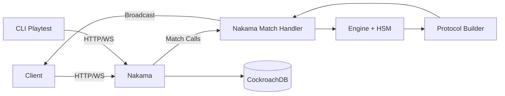
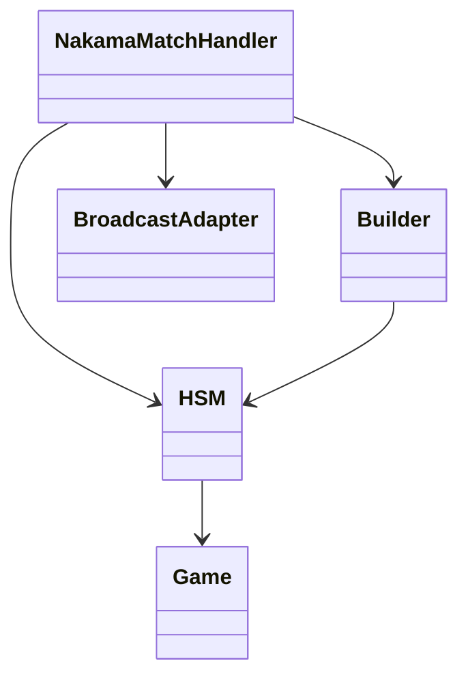

# ParaDiced 技术规划书（按课程模板）

## 需要考虑的问题

### 写作目标

本技术规划书用于明确 ParaDiced 游戏后端在课程阶段要解决的技术问题、实施边界与交付标准。

需要说明哪些问题：

1. 系统要解决什么业务问题，以及为何采用权威服务器模式。
2. 系统有哪些子系统、模块边界与协作关系。
3. 项目采用哪些技术栈以及为什么这么选。
4. 如何测试、如何量化性能、何时达到发布标准。
5. 主要技术风险及规避/缓解手段。

叙述与讨论范围和边界：

1. 范围内：后端（Nakama + Go 插件 + 协议层 + 状态机 + 回归 CLI）。
2. 范围内：课程阶段部署（本地/实验室 Docker 环境）与运维流程。
3. 范围外：正式生产级高可用集群、多地域容灾、商业化反作弊平台。
4. 范围外：完整客户端渲染实现（仅定义交互协议与联调方式）。

### 概念和术语

| 术语 | 定义 | 别名/易混淆项 | 本文特别说明 |
|---|---|---|---|
| 权威服务器 | 服务端为状态真源，客户端仅发操作与渲染 | P2P 同步 | 本项目采用权威模式，避免客户端篡改状态 |
| Nakama Match | Nakama 的实时对局实例 | 房间 | 本项目注册名为 `paradiced_match` |
| HSM | 分层状态机（Global/Turn/Interrupt） | 普通 FSM | HSM 支持中断与恢复，适合复杂回合流程 |
| StateSync | 状态同步消息 | 全量状态 | 用于状态进入、重连后状态拉齐 |
| TurnSync | 回合同步消息 | Action 列表 | 供客户端按顺序播放动作 |
| DecisionRequest | 决策请求消息 | 交互弹窗请求 | 用于需要玩家选择的时刻 |
| Buff | 持续效果 | 状态 | 作用在玩家，随回合 tick 或事件触发 |
| Item | 可主动使用道具 | 消耗品 | 常在主行动阶段触发 |
| Event | 地图或随机事件 | 事件卡 | 可正向、中性或负向 |
| LP/HP | 幸运值/生命值 | - | LP 影响事件倾向，HP 影响生存与回城 |

对于特殊定义与一般定义差异：

1. `TurnSync` 在本项目承载的是“动作播放日志”，而非仅仅“回合开始通知”。
2. `Decision` 在本项目用于状态机中断恢复，不等同于普通 UI 选项。

## 技术栈

所选择的技术栈包括但不限于：

1. 程序设计语言：Go 1.22.4（`go.mod`）。
2. 应用开发框架：Nakama 3.22.0（Go Runtime 插件）。
3. 运行环境与部署：Docker + Docker Compose，CockroachDB 单节点开发配置。

补充组件：

1. 协议层：`pkg/net`（OpCode、Message、Sync 结构）。
2. 业务引擎：`internal/engine`（Game、Action、HSM、Registry）。
3. Nakama 适配：`internal/nakama`（Match Handler、Dispatcher Adapter）。
4. 联调工具：Go CLI（`internal/cli`）用于可玩性回归。

技术选型理由：

1. Go + Nakama 适合实时多人权威逻辑，开发效率高、生态成熟。
2. HSM 对复杂回合流程的表达能力优于单层状态机。
3. Docker 环境便于课程阶段统一复现实验结果。

## 软件架构

### 软件总体架构

包含子系统：

1. 客户端子系统（外部）：发起登录、创建/加入对局、发送操作、接收同步。
2. 网关与会话子系统：Nakama HTTP/WS 接入、用户会话与连接管理。
3. 对局执行子系统：Go 插件 Match Handler + HSM + Action 执行。
4. 协议构建子系统：Builder 将内部模型映射到网络协议。
5. 存储子系统：CockroachDB（Nakama 元数据、会话与业务数据）。
6. 测试与回归子系统：CLI 自动化 playtest/soak。

子系统关系与工作模式（UML 组件图）：

### 各子系统内部

1. 对局执行子系统内部模块：`core`、`engine`、`event`、`gamemap`、`rng`。
2. 协议子系统内部模块：`pkg/net`、`internal/net`、`pkg/gamelog`。
3. 接入子系统内部模块：`internal/nakama`（lifecycle/message/presence/adapter）。

模块关系与工作模式（简化类图）：

## 软件设计和实现

### 需要针对哪些功能完成代码编写

1. 对局生命周期：初始化、轮次推进、结束判定。
2. 回合行为：投骰、道具、技能、决策中断与恢复。
3. 地图与事件：移动路径、落地触发、Buff 结算。
4. 协议发送：StateSync、TurnSync、Decision、Available、GameOver。
5. 运维可观测：结构化日志、错误分类、自动落盘。

### 需要完成哪些系统文档

1. 启动与部署文档：`README.md`、`doc/server_startup.md`。
2. 架构文档：`doc/internal/*.md`（core/hsm/net 等）。
3. 协议文档：`doc/internal/net_protocol.md`。
4. 元数据契约：`doc/metadata/*.md`。
5. 测试规划文档：本技术规划书 + CLI 计划 `cli.md`。

文档详细程度要求：

1. 能指导新成员从 0 启动并完成一次对局联调。
2. 能定位核心模块职责与关键接口含义。
3. 能据此执行回归并判断“可发布/不可发布”。

### 功能详细逻辑设计（实现阶段补完）

1. 回合主链路：MiniGame 排名 -> 骰子分配 -> 主行动 -> 移动 -> 事件 -> 回合结束。
2. 中断逻辑：DecisionRequest 触发后进入等待态，收到 UserChoice 后恢复。
3. 超时兜底：超时时走默认决策，避免死锁。

### 数据库和 API 接口设计（实现阶段补完）

1. 数据库：由 Nakama 管理连接与迁移，课程阶段以运行稳定为主。
2. API：以 Nakama HTTP/WS 与 MatchData 协议为主，重点是 OpCode 合约稳定。

## 软件测试和性能量度

### 测试计划

如何设计本系统测试：

1. 单元测试：覆盖核心纯逻辑（状态转换、规则执行、协议编解码）。
2. 集成测试：覆盖 Match Handler、HSM、Builder、Broadcast 协同。
3. 端到端测试：通过 CLI 模拟多玩家完整流程。

需要完成哪些单元测试：

1. `internal/engine/hsm`：状态进入、更新、转移、异常路径。
2. `internal/nakama`：消息路由、presence 处理、广播行为。
3. `pkg/net`：OpCode、Message、Sync 结构编解码。
4. `internal/gamemap`、`pkg/rng`：地图路径与随机机制边界。

需要完成哪些系统压力测试（含指标）：

1. 目标并发：课程阶段单机 20 个同时在线玩家连接不崩溃。
2. 回归压力：连续 30 局自动对局，成功率 >= 90%。
3. 稳定性：8 小时 soak 无 fatal/panic。

需要完成哪些真实测试（细节）：

1. 2 人、3 人、4 人对局各至少 5 局。
2. 断线重连场景至少 10 次，验证 FullSync 正确。
3. 非法消息/越权操作场景，验证服务端拒绝并可观测。

### 软件性能

如何量度软件性能：

1. 吞吐：每秒消息处理量（MatchData 处理次数）。
2. 延迟：从客户端发送到收到状态回执的 P95 延迟。
3. 资源：CPU、内存、goroutine 数量变化趋势。
4. 可靠性：错误率、超时率、崩溃次数。

性能能力边界（课程阶段）：

1. 单机单实例为主，不承诺生产级横向扩容指标。
2. 以 2-4 人对局正确性和稳定性优先，性能优化次之。

## 出口条件

满足以下标准后可发布课程版本：

1. 功能出口：4 人对局可完整跑通，支持创建、加入、行动、结算。
2. 质量出口：`go test ./...` 通过，关键包 `go test -race ./...` 通过。
3. 稳定性出口：30 局自动回归成功率 >= 90%，无阻断级崩溃。
4. 可运维出口：日志可通过 `docker compose logs` 与 `logs/nakama.log` 双通道查看。
5. 文档出口：启动、协议、架构、测试文档齐备，且可复现。

## 技术风险识别和评估

| 风险 | 影响 | 发生概率 | 应对策略 |
|---|---|---|---|
| Nakama 插件 ABI 不兼容 | 服务启动失败 | 中 | 固定 pluginbuilder 版本，构建链路标准化 |
| 状态机边界未覆盖 | 对局卡死/错乱 | 中 | 增加状态覆盖测试与超时默认策略 |
| 协议变更未同步客户端 | 联调失败 | 中 | OpCode 变更评审，CLI 回归先行 |
| 并发竞态 | 偶现错误难复现 | 低-中 | race 检测、压力回归、关键共享状态收敛 |
| Docker 环境差异 | 启动不可复现 | 中 | README 固化命令，统一 compose 配置 |

## 软件部署和维护

### 部署环境

1. OS：Linux/macOS 开发机，Docker Engine 环境。
2. 运行容器：`heroiclabs/nakama:3.22.0`、`cockroachdb/cockroach:latest-v23.1`。
3. 配置与挂载：`config.yml`、`modules/`、`logs/` 目录挂载。

### 运行与维护流程

1. 构建插件：`make build-plugin`。
2. 启动服务：`docker compose up -d`。
3. 健康检查：`docker compose ps`。
4. 查看日志：`docker compose logs -f nakama` 与 `tail -f logs/nakama.log`。
5. 更新插件：重编译后 `docker compose restart nakama`。
6. 数据清理：`docker compose down -v`（仅在需要重置环境时）。

### 系统层面的设计指标

1. 运行环境：容器化统一运行时，避免本地环境漂移。
2. 代码设计：强调抽象、模块化、信息隐藏与低耦合。
3. 架构设计：UI 与业务逻辑分离，错误记录机制可追踪，具备迭代弹性。
4. 系统性能：可支撑课程阶段并发对局与长时间回归。

### 业务流程层面的假设与异常处理

输入假设：

1. 客户端遵循 OpCode 协议并传递合法字段。
2. 对局人数在 2-4 区间。

异常处理：

1. 非法 OpCode 或非法时机请求直接忽略或拒绝，不破坏状态机。
2. 决策超时走默认值，避免流程阻塞。
3. 玩家断线后允许重连并通过 FullSync 拉齐状态。

## 附：课程要求映射（截图版）

1. 写作目标：已覆盖“需要说明哪些问题、范围边界”。
2. 概念和术语：已提供术语表、特别定义、易混术语区分。
3. 技术栈：已明确语言、框架、运行环境。
4. 软件架构：已给出子系统、模块职责、关系与 UML 图。
5. 软件设计和实现：已列代码任务、文档任务、逻辑/API 留白策略。
6. 测试计划：已包含单元、系统、压力、真实测试及指标。
7. 软件性能：已给量度方法与技术边界。
8. 出口条件：已给发布门槛。
9. 技术风险：已识别并给出应对。
10. 部署维护：已说明环境、部署步骤、维护流程。
